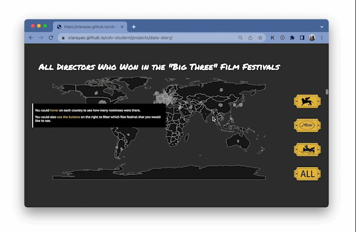

# Data Story
## The Project: Whose Stories Get to Be Heard?

 - Link to the [project](https://clarayao.github.io/cdv-student/projects/data-story/).
 - 
 - You may have heard the lack of diversity in the film industry worldwide, but how not diverse it really is? In this project, you can get a glimpse of the diversity in gender and geographical region of the main competition in the "Big Three" Film Festival (Venice, Cannes, Berlin Film Festival)!
 - All the data that I used for this project is some information that I scraped from wikipedia: [Venice](https://en.wikipedia.org/wiki/Category:Venice_Film_Festival),[Cannes](https://en.wikipedia.org/wiki/Category:Cannes_Film_Festival),[Berlin](https://en.wikipedia.org/wiki/Category:Berlin_International_Film_Festival).
  - These are the python codes for the data scraping process
    - [Venice Juries](data-scraping/venice_jury.py), [Venice Nominated Directors](data-scraping/venice_awards.py)
    - [Cannes Juries](data-scraping/cannes_jury.py), [Cannes Nominated Directors](data-scraping/cannes_awards.py)
    - [Berlin Juries](data-scraping/berlin_jury.py), [Berlin Nominated Directors](data-scraping/berlin_awards.py)
  - Generally speaking, I got the wikipedia websites of each film festival that carry the link to each year's wiki page. Then I let the code to click in to each year's link and look for the section which contains the information that I want.
  - For the juries, inside each year's page, there're always a section that carries all the juries' name & wiki link and the jury's nationality. Then I use program to click into each jury's link and get the first paragraph of the jury's wiki page, and count how many "he" or "she" there is, to identify the jury's gender. If there's no "he"/"she", or the amount of words is not convincing enough, then there will be an input box for me to search that jury and input that name.
  - For the awards, it's almost the same as the juries. But what's more is that I also went to the wiki page of that film and get the poster of that film.
  - In addition there's also a manual procedure where I input the nationality of the directors of the nominated films, because many directors' page are differect, it's hard to use code to identify.

## The Process

- Why did you choose to visualize the data in this way?
  - Bar chart + Map + Force Graph: I used different types of chart because I believe this will add more diversity into the project and make it looks more interesting.
  - Gender graph (bar chart): In this graph I used bar chart becuase I think this will make apparent how imbalance the number of female and male directors is; and also the color (pink for female and blue for male) would make the different more striking as well.
  - Map: This graph is intended to show how the nominees are usually crowded in one country/one region. And I believe a map is a more direct and intuitive way to show this.
  - Intersection graph (first force graph): I choose a force graph because I believe it will show each year & each continent as a group, which would be clear to get a sense of which continent has more nominees. And later I bring the colors that represent both gender. I think this would be great to see the intersectionality of each group of data.
  - Comparison graph (last graph): In this graph, I placed jury and nominees in one graph with both gender and continent features so that viewers could get a wholistic view of the project.
- What can be seen in the visualization? Does it reveal something you didn't expect?
  - The visualization shows the lack of diversity of the nominated directors in the main competition of the "Big Three" film festivals.
  - What I didn't expect is that the juries selected for each film festival is quite balanced in gender. However, in the selection, the gender is strikingly imbalanced, which let me question why the diversity of juries won't positively influence the selection?
- Did you make crucial compromises? Which ones?
  - Map: I initially wanted to make a slider for each year so that viewers could also see each film festival's geographical distribution by year. However, it was too complicated for me to nest the year's buttons inside each film festival's buttons. And also the datapoints are not enough to let the viewers see clearly how they are distributed.
  - Force graphs: In the force graphs, I though it would be better for the pink points to stay together and the blue ones together. However I wasn't able to do that because the "sort()"" function always gives an error and I can't figure out why.
- If you had more time, what would you change, improve, add to the project?
  - I would like to debug the intersection part. Beacuse now after adding color to the graph, the film festivals' buttons would only bring buttons that are white to the graph. I wish I could figure that out.
  - I wanted to make the buttons appear different after clicking, but I don't have enough knowledge about css to make that happen. I've tried to use ":target" as suggested by google, but that didn't work. I would like to add that interaction if I know how.
  - Also the website doesn't really adapt to all browser size. I wish I could have the time to learn more about css, html to make it more responsive.
