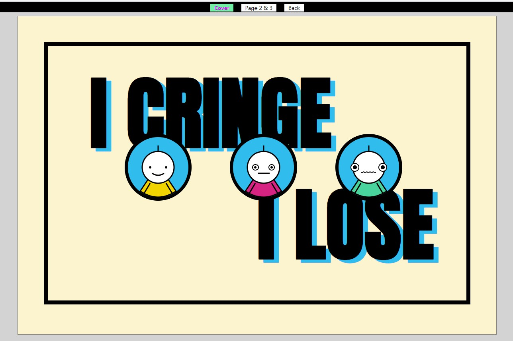
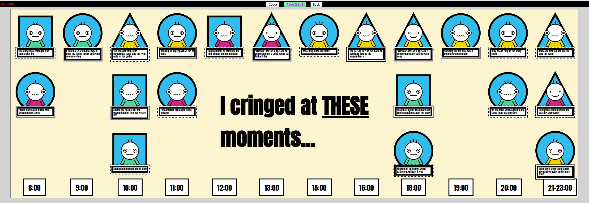
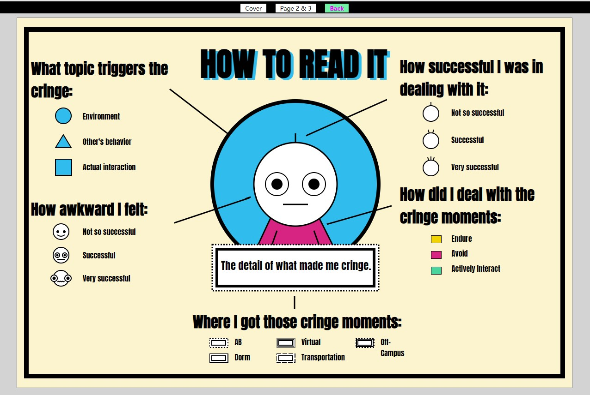

# Data-Zine
[This](https://clarayao.github.io/cdv-student/projects/data-zine-cringe/) is the link to the live website

## What data did you choose to collect? How did you decide on this subject?
I chose to collect the awkward moments that I encountered from March 5th to March 9th. I initially had two other plans: 1). the times that I looked at the sky, which was given up because it's very hard to specifically define the range of the sky; 2). the questions that I came up, which I give up because I found it hard to come up with a great visualization.
Then, during the process of collecting data for 2), I came up with a question "why do I get awkward so easily", which triggers me to choose this theme as my project. I also think that it's interesting to do a project that is for fun, instead of always trying to do something insightful.
## How did you collect it, what was the routine? How did it go?
I wrote down the main data features that I wanted to collect on my phone memo, and dried to make them as detailed as possible, so that there's still room for adjustment. Then, after collecting all the data, I reorganized the features and filled them out in a google form. I tried my best to note them down whenever I noticed that I felt awkward. However, I always forgot to do so when I first collected the data. Thus, the data that I used for this project was collected for a second round, although I still left out some moments that I felt awkward. But overall, it's much better than the first round.
## How did you arrive at the visual design? Why did you choose to visualize the data in this way?
I first searched the key word "awkward" and "cringe" on the internet, and found that the pictures that resonates with me the most is the meme. Thus, I chose to draw a cartoon figure with different facial expression as the main part of the project to show the awkwardness better. And based on the cartoon figure, I figured that drawing the whole visualization as a comic/cartoon would give the visualization with more consistency.
## What can be seen in the visualization? Does it reveal something you didn't expect?
In the visualization, there are 1). the time that I had the cringe mooment; 2). the location where I had that cringe, represented by the different styles of the text box; 3). what topic triggered the cringe, represented by the shape of the background; 4). how did I deal with the cringe moments, represented by different colors of the clothes; 5). how awkward I felt at that moment, represemted by the different facial expression; 6). and how successful I was in dealing with it, represented by the number of hairs the figure has.
Given the large amount of yellow clothes in the picture, I didn't expected that I mostly dealt with the awkward moments by enduring it, because I used to thought that I would prefer avoding those moments. Also, It's interesting that mostly I dealt with the most awkward moments least succesfully, which I think I could work on in the future.
## Did you make crucial compromises? Which ones?
Initially I wanted to indicate the location of where I was by using different color backgrounds. However, after trying out, I found that it's very hard to make the colors look pleasing if there are too many colors. Thus, I substituted this by changing the style of the text boxes.
Also, I wanted to arrange each figure more randomly. However, I don't know how to place each figure randomly without letting them overlap with each other. Thus, I gave up and chose to visualize it in a neater way.
## If this project had a larger scaler and wasn't designed for print, how would you imagine it to be?
I think adding some selection buttons that viewers can click on and select which features they want to view in particular, might make the features more intuitive.
